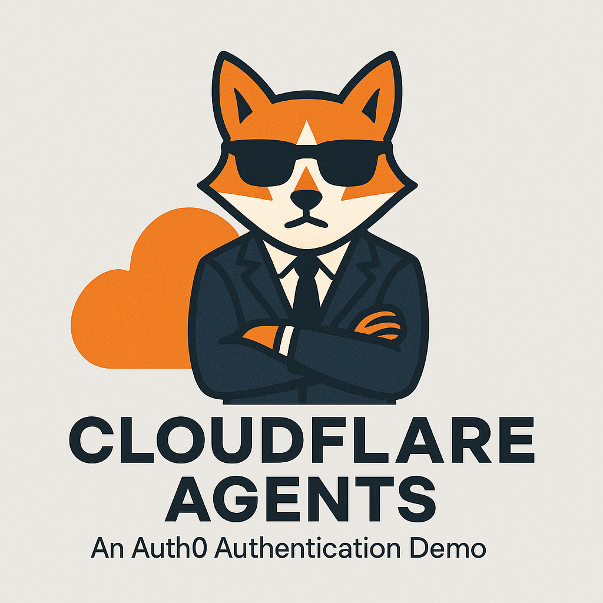

# 🤖 Chat Agent Starter Kit with Auth0 Authentication



A starter template for building AI-powered chat agents using Cloudflare's Agent platform, powered by [`agents`](https://www.npmjs.com/package/agents) and secured with Auth0 authentication. This project provides a foundation for creating interactive chat experiences with AI, complete with a modern UI, tool integration capabilities, and user authentication.

## Features

- 💬 Interactive chat interface with AI
- 🔐 Auth0 authentication and authorization
- 👤 User-specific chat history and management
- 🛠️ Built-in tool system with human-in-the-loop confirmation
- 📅 Advanced task scheduling (one-time, delayed, and recurring via cron)
- 🌓 Dark/Light theme support
- ⚡️ Real-time streaming responses
- 🔄 State management and chat history
- 🎨 Modern, responsive UI

## Prerequisites

- Cloudflare account with Workers & Workers AI enabled
- OpenAI API key
- Auth0 account with a configured:
  - Single Page Application (SPA client)
  - API (resource server)

## Auth0 Configuration

### Step 1: Create an Auth0 API

1. Log in to your Auth0 dashboard
2. Navigate to "Applications > APIs" and click "Create API"
3. Provide a name and identifier (audience)
4. Under settings, make sure "Allow Offline Access" is enabled
5. Note the API Identifier (audience) for later use

### Step 2: Create an Auth0 Application (SPA)

1. In your Auth0 dashboard, go to "Applications" and click "Create Application"
2. Select "Single Page Application" as the application type
3. Configure the following settings:
   - Allowed Callback URLs: `http://localhost:3000/api/auth/callback` (development) and your production URL
   - Allowed Logout URLs: `http://localhost:3000` (development) and your production URL
   - Allowed Web Origins: `http://localhost:3000` (development) and your production URL
4. Under "Advanced Settings > OAuth", ensure that:
   - "JSON Web Token (JWT) Signature Algorithm" is set to RS256
   - "OIDC Conformant" is enabled
5. Note your Domain, Client ID, and Client Secret for later use

## Quick Start

1. Clone the repository:

```bash
git clone https://github.com/jfromaniello/cloudflare-agent-with-auth.git
cd cloudflare-agent-with-auth
```

2. Install dependencies:

```bash
npm install
```

3. Set up your environment:

Create a `.dev.vars` file based on the example:

```env
# OpenAI API key
OPENAI_API_KEY=sk-your-openai-api-key

# Auth0 Configuration
# trailing slash in ISSUER is important:
OIDC_ISSUER_URL="https://your-tenant.us.auth0.com/"
OIDC_CLIENT_ID="your-auth0-client-id"
OIDC_CLIENT_SECRET="your-auth0-client-secret"
OIDC_SESSION_ENCRYPTION_KEY="generate-a-random-key-at-least-32-characters-long"
OIDC_AUDIENCE="https://your-auth0-api-identifier"

# Application base URL
BASE_URL=http://localhost:3000
```

4. Run locally:

```bash
npm start
```

5. Deploy:

```bash
npm run deploy
```

## Project Structure

```
├── src/
│   ├── server.ts                # Main worker with auth configuration
│   ├── chats.ts                 # Chat management functions
│   ├── agent/                   # Agent-related code
│   │   ├── index.ts             # Chat agent implementation with Auth0 integration
│   │   ├── tools.ts             # Tool definitions and implementations
│   │   ├── utils.ts             # Agent utility functions
│   │   └── shared.ts            # Shared constants and types
│   ├── client/                  # Frontend client application
│   │   ├── app.tsx              # Chat UI implementation
│   │   ├── home.tsx             # Home page component
│   │   ├── index.tsx            # Entry point for React app
│   │   ├── Layout.tsx           # Layout component
│   │   └── styles.css           # UI styling
│   ├── components/              # UI components
│   │   ├── auth0/               # Auth0-specific components
│   │   ├── chatList/            # Chat list components
│   │   └── ...                  # Other UI components
│   └── hooks/                   # React hooks
│       ├── useUser.tsx          # User authentication hook
│       └── ...                  # Other custom hooks
```

## Authentication Flow

This starter kit uses Auth0 for authentication and authorization:

1. Users log in using Auth0 credentials
2. Auth0 provides JWT tokens for API authentication
3. The Agent use the `WithAuth` mixin from the `agents-oauth2-jwt-bearer` package to validate the JWT token
4. API requests and WebSocket connections are secured with the JWT token
5. Each chat is associated with its owner (user ID) to ensure data isolation

### Authentication Packages

This project utilizes two key npm packages for authentication:

- [`hono-openid-connect`](https://github.com/honojs/middleware/tree/main/packages/auth-js/openid-connect) - Handles browser-based authentication flows, session management, and token handling for the web interface.
- [`agents-oauth2-jwt-bearer`](https://github.com/cloudflare/agents/tree/main/packages/agents-oauth2-jwt-bearer) - Secures WebSocket connections and API endpoints for the agent, providing JWT validation and authorization for all agent interactions.

These packages work together to provide a comprehensive authentication solution that secures both the web interface and the underlying agent communication.

## Customization Guide

### Adding New Tools

Add new tools in `src/agent/tools.ts` using the tool builder:

```typescript
// Example of a tool that requires confirmation
const searchDatabase = tool({
  description: "Search the database for user records",
  parameters: z.object({
    query: z.string(),
    limit: z.number().optional(),
  }),
  // No execute function = requires confirmation
});

// Example of an auto-executing tool
const getCurrentTime = tool({
  description: "Get current server time",
  parameters: z.object({}),
  execute: async () => new Date().toISOString(),
});
```

To handle tool confirmations, add execution functions to the `executions` object:

```typescript
export const executions = {
  searchDatabase: async ({
    query,
    limit,
  }: {
    query: string;
    limit?: number;
  }) => {
    // Implementation for when the tool is confirmed
    const results = await db.search(query, limit);
    return results;
  },
  // Add more execution handlers for other tools that require confirmation
};
```

### Extending Auth0 Integration

The integration uses Hono's OpenID Connect middleware for authentication and session management. You can customize the authentication behavior in `src/server.ts`.

The agent uses the `WithAuth` mixin from `agents-oauth2-jwt-bearer` package to secure API endpoints and WebSocket connections. Each chat is associated with its owner through the `setOwner` method to ensure users can only access their own chats.

## Learn More

- [`agents`](https://github.com/cloudflare/agents/blob/main/packages/agents/README.md)
- [`agents-oauth2-jwt-bearer`](https://github.com/cloudflare/agents/tree/main/packages/agents-oauth2-jwt-bearer)
- [Cloudflare Agents Documentation](https://developers.cloudflare.com/agents/)
- [Cloudflare Workers Documentation](https://developers.cloudflare.com/workers/)
- [Auth0 Documentation](https://auth0.com/docs/)

## License

MIT
